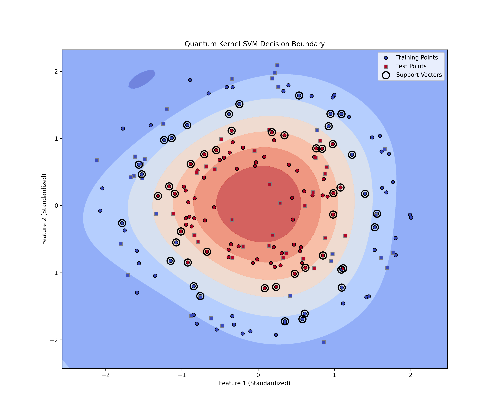

# QFlow

QFlow is a Kubernetes-native dataflow system for running quantum circuits and integrating their results into classical 
pipelines. It is designed to be practical, minimal, and easy to explore for developers interested in quantum workflows. 
The quantum simulator is already capable of parsing and running OpenQASM files, and the QFlow DSL allows users to define 
quantum workflows in a simple way.

Some of the capabilities include:
- **Quantum Circuit Execution**: Run quantum circuits using a simulator (by default, uses my own).
- **Custom Resource Definitions (CRDs)**: Define quantum workflows and tasks using a simple DSL.
- **Kubernetes Operator**: Manage quantum jobs, track their status, and update results in the cluster.
- **Frontend**: A simple HTML interface to view the status of quantum workflows and resources.
- **Compiler**: Convert OpenQASM or QFlow DSL files into Kubernetes CRDs for use with the operator.
- **Quantum Circuit Born Machines (QCBM)**: Initial support for running QCBM experiments.

## Project Structure

This repo is a Rust Workspace containing several components that work together to provide a complete quantum dataflow solution:

- **qflow-backend/**: API backend serving pipeline and resource status to the frontend.
- **qflow-operator/**: Kubernetes operator managing QFlow custom resources, running quantum jobs, and updating results.
- **qflowc/**: Compiler for the QFlow DSL. Converts OpenQASM or QFlow DSL files into Kubernetes CRDs for use with the operator.
- **qsim/**: Standalone quantum circuit simulator. Used by the operator, but can be run independently.
- **qcl/**: A new crate for defining and running hybrid quantum-classical workflows using a simple, extensible DSL inspired by Lisp. Use this to experiment with variational algorithms, parameterized circuits, and classical control logic in a REPL or scriptable environment.
- wasm-ui/: A web-based UI for QFlow, allowing users to design quantum circuits and workflows in the browser. It uses a WASM implementation of the simulator to run experiments directly in the browser.

## Quickstart

Run a quantum circuit example with the simulator:

```bash
cargo run --bin qsim -- --input-file qsim/examples/bell.qasm --output-file results.json
```

Compile a QFlow DSL file to a CRD and apply it to your cluster:

```bash
cat qflow-operator/tests/dag-test.qflow | cargo run -p qflowc | kubectl apply -f -
```

# Why?

In the past, I've enjoyed writing my own quantum simulators (last time in Go) and various types of programming languages.
An ambitious project like this also allows me to combine quantum computing, Rust, Kubernetes and machine learning in a single project.
As I often have limited free time, this kinda let me tackle a few things at once. 

I've always loved taking complex problems and making them simpler for users. When applied correctly, abstractions can make
it easier for users to reason about what the actual problems they are looking to solve are.

# UI (Work in Progress)

I've recently started work in the wasm-ui directory to re-design the frontend using more modern web technologies like
react and an initial WASM implementation of the simulator. This allows the UI to run the simulation directly in the browser.


It will be a long road to get there, but I have created initial support for a language called QCL (Quantum Control Language)
that will be used to define hybrid workflows in a hopefully simple and extensible way. The goal is to allow users to
have an easy way to create training experiments and get feedback in realtime. Here is one of the first working examples 
I was able to cook up:


Like the standard circuit designer, this also uses the WASM simulator to run the experiments directly in the browser.

# Example Results

The following image shows the results of running against the "make_circles" dataset from scikit-learn. You can find out 
more about the experiment in the `ml/` directory.




## Next Steps

- Explore the `examples/` folders in `qsim/` and `qflowc/` for sample circuits and workflows.
- See individual component READMEs for more details.


# Up Next
- Working on some automation to make it easier to get up and running with QFlow (something like `make deploy`)
- Adding more documentation and examples
