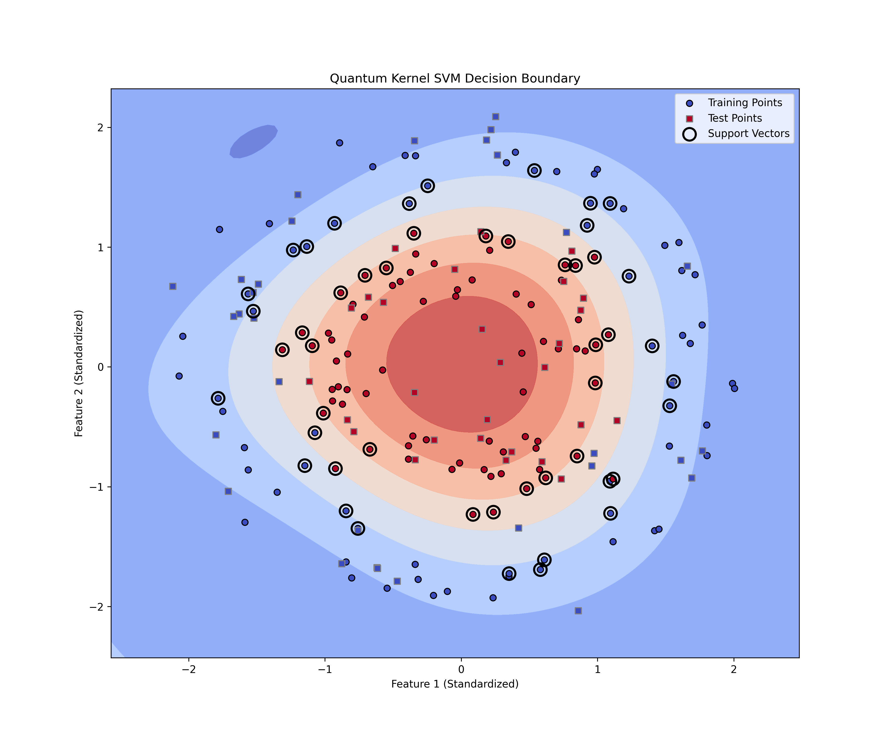

# ML

This directory is a sort of symbiosis between classical and quantum machine learning. It uses scikit-learn to provide a baseline.
Qsim will then use this baseline as something to compare results against. 


The whole process can be run with the following command:

```bash
python svm.py
```

This will run both the classical and quantum SVMs, and then compare the results. The results displayed as an image with 
both the classical and quantum SVMs plotted on the same graph.


# Dependencies
- scikit-learn
- matplotlib
- numpy
- qsim (for quantum SVM)
- maturin (for accessing qsim from Python)

# Building with maturin

To build the qsim Python bindings, you need to have maturin installed. You can install it with:

```bash
pip install maturin
```

Then, you can build the bindings with:

```bash
maturin develop
```

# Example Results

The following image shows the results of running against the "make_circles" dataset from scikit-learn.



# TODO sort

create dummy data for testing

python svm2.py --create-dummy-data blobs_data.csv --dummy-type blobs

python svm2.py --data_path blobs_data.csv --target-column "target" --output-plot local_plot.png --output-metrics local_metrics.txt